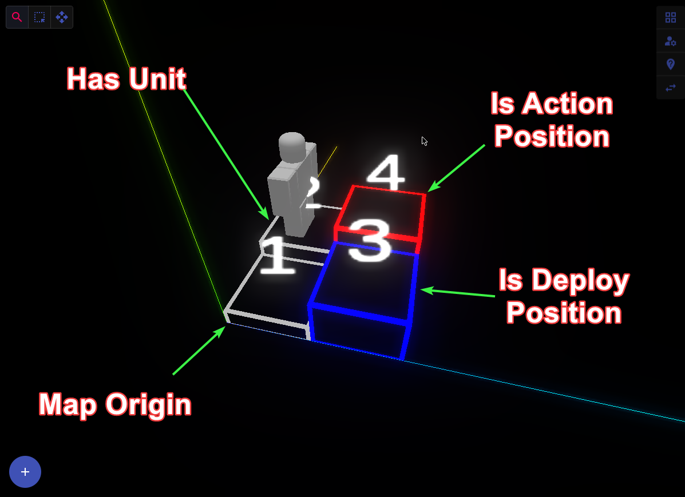
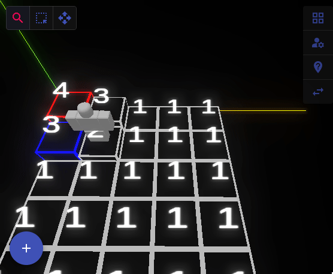

# My App Tutorial

Welcome to the tutorial for **Roblox Map Editor** This guide will walk you through the key features and configurations to help you get the most out of the app.

---

## Table of Contents

1. [Reading the Map](#reading-the-map)
2. [Tile Configuration](#tile-configuration)
3. [Unit Configuration](#unit-configuration)
4. [Position Configuration](#position-configuration)
5. [Different Tools](#different-tools)
6. [Saving, Loading, and Creating](#saving-loading-and-creating)
7. [TODO](#todo)

---

## Reading the Map

Understanding how to read the map is the first step to using the app.

### Visual Key:

    * Tiles: Represented by rectangles on a grid. these are the building blocks of the map where you can place units and configure deploy/action positions.
    * Height: Represented by a number on each tile. This indicates the height of the tile.
    * Units: Represented by a Robloxian figure. These entities will be drawn on the tiles that have units configured.
    * Deploy Position: Represented by a blue highlight on a tile.
    * Action Position: Represented by a red highlight on a tile.
    * Map Origin: The map origin is where the axis meet. This is the starting point of the grid and represents the (1,0) coordinate.

## Tile Configuration

This section explains how to configure the tiles in your app.

### Steps:

1. **Selecting a Tile:**

    - There are two ways to select a tile for editing. You can use the single tile selection (Inspect tool) or the multi-tile selection (Select tool).
      once you have selected a tool, you can click on any tile then use the side panel menu to access different configuration options.
    - Example: `Click on any tile to open the configuration options in the sidebar.`

2. **Tile Properties:**

    - Tile Properties include options like height, unit, and deploy/action positions.
    - Example: `You can change the height of a tile by adjusting the value in the properties panel.`

3. **Saving Tile Configurations:**
    - Height configuations are automatically saved when adjusted, but other configurations require you to click the "Save" button.
    - Example: `Click "Save" after making changes to keep your Deploy/Action/Unit configuration.`

---

## Unit Configuration

This section covers how to configure units within the app.

### Steps:

1. **Adding a New Unit:**

    - To add a Unit to a tile, select the tile(s) you want to add the unit to, then in the side panel menue, access the unit configuration panel and
      edit the unit properties. Once you are done, click the "Save Unit" button to save the configuration.
    - Example: `Press "Save Unit" after configuring the unit to add it to the selected tile(s).`

2. **Delete a Unit:**

    - To remove a unit from a tile, select the tile(s) with the unit you want to remove, then in the side panel menue, access the unit configuration panel and
      click the "Remove Unit" button.
    - Example: `Click "Delete Unit" to delete the unit from the selected tile(s).`

3. **Pro Tips:**

    - You can add duplicate units to multiple tiles by using the select tool to select multiple tiles, then adding the unit to all selected tiles at once.
    - You can even use the inspect tool to load a units configuratios from one tile, then use the select tool to select multiple tiles and apply the same unit configuration to all selected tiles.

---

## Position Configuration

Learn how to edit deploy and action positions for tiles.

### Steps:

1. **Deploy Position:**

    - Select a tile and click the checkbox to enable or disable the deploy position. Remeber to click the "Save" button to save the configuration.

2. **Action Position:**

    - Similar to the deploy position, you can enable or disable the action position for a tile. Remember to click the "Save" button to save the configuration.
    - You can also name the tile and give it an EventID.

---

## Different Tools

An overview of the tools available in the app.

### Tool Descriptions:

1. **Inspect Tool:**

    - This tools primary purpose is to inspect the Unit properties of a tile. You can also use it to individually select tiles for editing.

2. **Select Tool:**

    - This is a multi-tile selection tool. You can use it to select multiple tiles at once for editing.

3. **Move Tool:**

    - This tool allows you to move tiles around the grid. You can use it to reposition tiles as needed.
    - To use the move tool, select the tile(s) you want to move, then using the arrow keys on your keyboard, move the tiles around the grid.

---

## Saving, Loading, and Creating new maps

Learn how to save, load, and create new projects.

### Steps:

1. **Saving Configurations:**

    - In the radial menue, click the "Save" button to save your current map.

2. **Loading a Project:**

    - From the radial menue, click the "Load" button to load a previously saved project. You can then select the file you want to load.

3. **Creating a New Project:**
    - In the radial menue, click the "Create" button to create a new project.
    - You will be prompted to specify the grid size of the new project before creating it.
    - This will reset the grid and clear all configurations so make sure to save your current project before creating a new one.

---

## TODO

1. **Add Keyboard Shortcuts:**

    - Add keyboard shortcuts for different tools and actions to make the app more user-friendly.
    - Add keyboard shortcut to save the project.
    - Fix the issue with the move tool not working properly.

## Conclusion

Enjoy using the Roblox Map Editor app and feel free to reach out if you have any questions or need further assistance.
